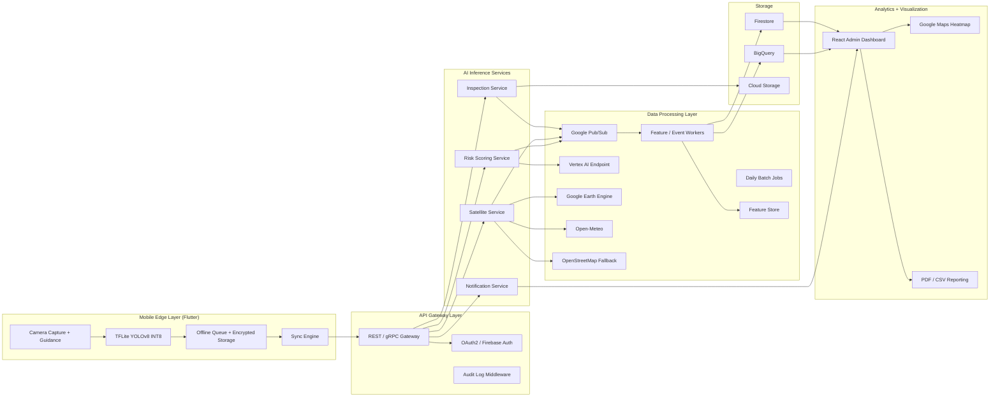

# SlumSafe CV Architecture

## System diagram

## Bounded contexts

- `Inspection`: capture sessions, media metadata, upload lifecycle, and inspector workflow state.
- `Risk`: feature aggregation, explainability, ranking, confidence scoring, and reinspection scheduling.
- `Satellite`: parcel lookup, Earth Engine orchestration, fallback radar analysis, and coverage health.
- `Notification`: alerts, escalation policies, and multi-role delivery.
- `Analytics`: heatmaps, drill-down metrics, exports, and multi-city tenancy.

## Architectural decisions

- Offline-first mobile workflow stores inspections locally and syncs with idempotent retries.
- Event-driven communication decouples upload, enrichment, scoring, and notification steps.
- Firestore supports operational sync; BigQuery stores analytical and ML feature tables.
- Vertex AI hosts the risk model while the mobile app runs quantized damage detection on-device.
- Demo mode mirrors production contracts but sources features from `data/demo` rather than live systems.

## Reliability and degraded modes

- Poor image quality triggers a retake prompt before an upload event is emitted.
- Missing satellite optical coverage falls back to Sentinel-1 SAR; if both fail, the feature vector is marked partial and the risk model lowers confidence.
- Missing building footprints fall back from municipal GIS to OpenStreetMap-derived polygons.
- All services emit audit logs and trace IDs for replay and incident response.

## Scalability notes

- Services are stateless and horizontally scalable on GKE.
- Pub/Sub smooths bursty mobile uploads during city-wide campaigns.
- Feature aggregation is partitioned by `city_id` and `structure_id` for multi-city tenancy.
- Dashboard analytics query BigQuery materialized views rather than operational collections.

